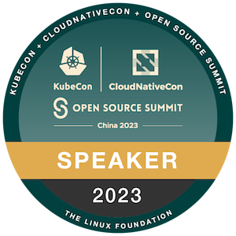

<h2 align="center">Hi 👋, I'm Jiekun.dev</h1>

   

## Who could become the maintainer?
许多打工人只是工作需要写点代码，恰巧这些代码需要写在开源软件上。他们不会关注软件社群里其他用户的问题，因为“这跟我有什么关系呢”。而社群的维护者是对社群生产的软件有极高的认同感和责任心，并且自觉有义务推广它的使用的人，自然会关注使用软件的人碰到的问题，解决问题促进使用，总结问题看看软件哪些方面还有不足。[1]
- [1] Maintainer 的标准. (2022, September 12). 夜天之书. [https://www.tisonkun.org/2022/09/12/maintainer-criterions/](https://www.tisonkun.org/2022/09/12/maintainer-criterions/)
