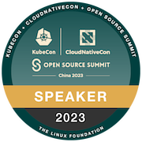

<h2 align="center">Hi 👋, I'm Zhu Jiekun</h1>

    

## About Me
- I graduated in 2018 with a bachelor's degree in Vehicle Engineering. 
- I have 3.5 years of experience in **Python**, 3 years in **Go**, and I'm currently learning **Rust**.
- I am currently working and learning in the field of **Observability**, with a focus on **OpenTelemetry**, **Prometheus**, and **eBPF**.

## Where Do I Acquire Knowledge?
- Fundamentals: Books, blogs, documentation, and communities (Slack).
- Bleeding edge: Papers.

## Recent Goals
- Speaking about my observability experience at KubeCon in Europe or North America.
- Writing a paper on Observability-related topics.

## My Badges

## My Talks
- **Balancing Cost and Quality in OpenTelemetry: An Evaluation of Sampling Policies**, 27 Sept. 2023 | [Slides](https://docs.google.com/presentation/d/16PHf3XxZBuLjD0b07SMJmk0yfFAHB2jJpMPGgONngRE/edit?usp=sharing) | [Blog](https://jiekun.dev/posts/kubecon-2023-otel-sampling/) | [Video](https://youtu.be/hDLQi6HeW0k?si=kCjX4y4BCRSswdaM)

## Who could become the maintainer?
许多打工人只是工作需要写点代码，恰巧这些代码需要写在开源软件上。他们不会关注软件社群里其他用户的问题，因为“这跟我有什么关系呢”。而社群的维护者是对社群生产的软件有极高的认同感和责任心，并且自觉有义务推广它的使用的人，自然会关注使用软件的人碰到的问题，解决问题促进使用，总结问题看看软件哪些方面还有不足。[1]
- [1] Maintainer 的标准. (2022, September 12). 夜天之书. [https://www.tisonkun.org/2022/09/12/maintainer-criterions/](https://www.tisonkun.org/2022/09/12/maintainer-criterions/)
